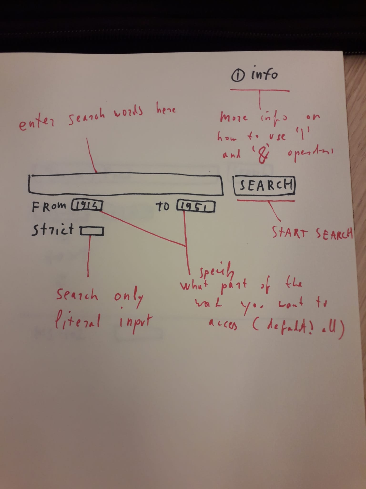
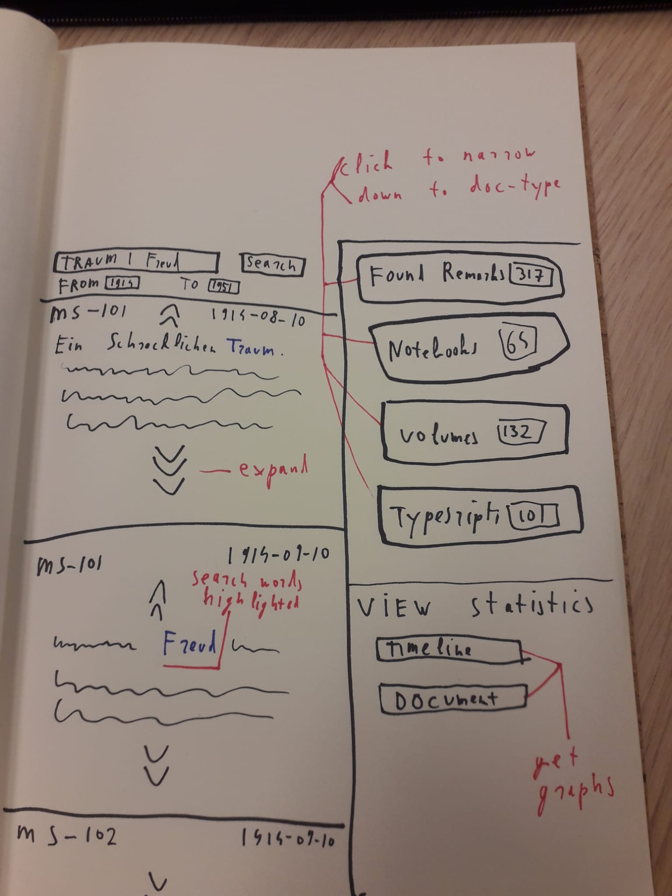

# proposal project
student: Cees Paris - 10791302
date: 06-12-2021

**problem statement**

Most of the work of the late philosopher Ludwig Wittgenstein has remained unpublished to this day. Consequentially, any thoroughgoing research into his thought or life has to delve into his unpublished work. The methods that are currently in place to search this large body of chronologically ordered, but otherwise unorganised work are  lacking in ways that impede focused philosophical research. 

**proposed solution**

This application will offer an alternative search engine for the unpublished work of Wittgenstein. The focus of this engine will be to optimize the search engine specifically for philosophical research. 

*start screen*

*search resulsts*

*visualizations search results*

**data sources**

- xml files containing samples of unpublished work (available through [university of bergen](http://wab.uib.no/cost-a32_xml/))

**external components**
- Plotly Javascript for visualizations of the occurence of searchword(s) in the database

**similar webapps**
-Open Access to transcriptions of the Wittgenstein Nachlass from the university of Bergen, Nachlass search engine

This is the only real ‘competitor’(also the site from which I will lift the actual manuscripts). What is good about the site is that it has some advanced features, 
Such as returning the ‘types’ of source where the words is found (found remarks, manuscripts, typescripts etc.) and the number of times the word respectively occurs in these types. It also does not only return the locations the word was found but also a fragment of the text in which the word is present, that you can expand. Another very useful ability is that you can filter on years. For example, you can search for a word only in the unpublished works between 1932 and 1934. 
It also provides visualisations for the occurrence of a word throughout the years. 

What is bad about the site is that it it lacking some functionality which is crucial for efficient research. 
For a start, you can either search for multiple words in the whole body of work, or for two words connect with a literal ‘&’ sign, but you cannot search for places in the work where two words are in close vicinity to each other, although not directly tied via an ‘&’-sign.  
The second issue is that there is no way to limit search to literal input. Words occurring in other words are also returned. 

It is often the case that you are interested in a word only in a specific context. For example, you want to research what Wittgenstein said about dreams, but specifically in relation to Freud. Such a combined search is currently hard to do in this search engine, which leads to inefficient searching of the work. 

The visualisations of the data returned are also uninformative as they stand. It would be better to be able to separate the search words you typed in, to see how much and where they occur in the body of work. 

Also, the search engine on the whole is not very user friendly. 

**hardest parts**

- getting the complete unpublished work as xml-file
- implement a program that can search this xml file not only for specific words, but also for passages where multiple words occur. 
- search for the searchwords individually as well as for 'contexts' where they all occur, so that the subsequent visualizations can be a lot more informative. 
- keeping intact the functionality of the University of Bergen search engine, by making use of the xml make up (keeping track of what kind of work the word is found in etc.)

