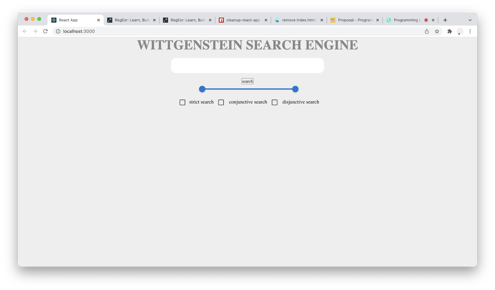
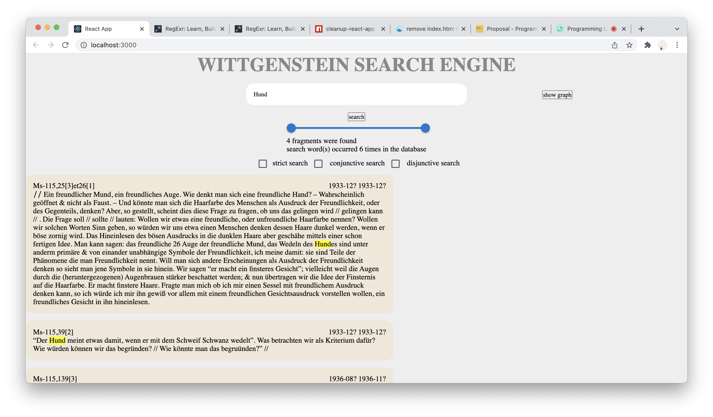
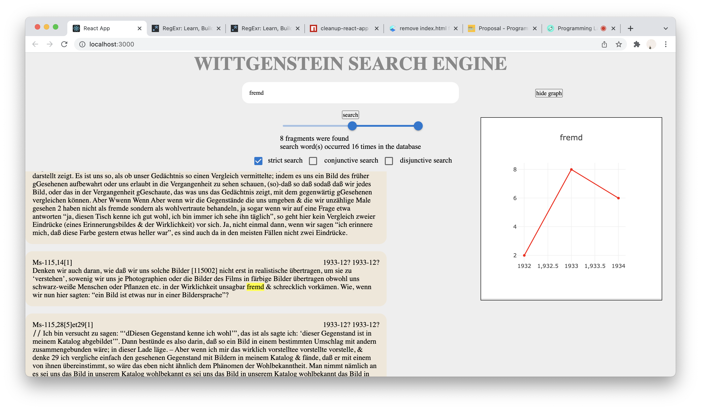

# Final Product
student: Cees Paris - 10791302
date: 06-12-2021

**problem statement**

Most of the work of the late philosopher Ludwig Wittgenstein has remained unpublished to this day. Consequentially, any thoroughgoing research into his thought or life has to delve into his unpublished work. The methods that are currently in place to search this large body of chronologically ordered, but otherwise unorganised work are  lacking in ways that impede focused philosophical research. 

**solution**

This application offers an alternative search engine for the unpublished work of Wittgenstein. The focus of this engine will be to optimize the search engine specifically for philosophical research. 

*start screen*

*search results for 'Hund'*

*strict search results and graph for 'fremd'*

**basic functionality**
- searches for user's input through a database consisting of a part of the unpublished manuscripts of Ludwig Wittgenstein. Returns fragments in which the input is found, along with the date and name of the manuscript in which it was found

**additional functionality**
- highlights search words in search results
- provides a graphical visualization of search results 
- allows the user to search for multiple words at the same time (disjunctive search), or for fragments in which multiple words occur seperately (conjunctive search)
- allows searching for occurences of the literal input only (strict search), for example, searching for 'fremd' but not for 'Befremdung'

**further ideas for adding functionality**
- allowing hybrid searches using logic symbols (fremd|Schein && Traum)
- showing different words in different lines in the graphical representation 
- including links to the complete manuscript to each of the search results
- creating a database consisting of the complete unpublished works of Wittgenstein 

**data sources**

- xml files containing samples of unpublished work (available through [university of bergen](http://wab.uib.no/cost-a32_xml/))

**acknowledgements**
- Plotly Javascript for visualizations of the occurence of searchword(s) in the database
- react-virtualized, used for returning the result-components to the screen
- In my scripts folder, I used the helpers.py which was given in the imdb-scraping asignment
- I made use of the MUI library for my slider and checkboxes
- I made use of the Highlighter component from react-highlight-words

